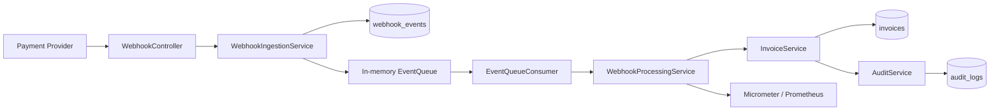
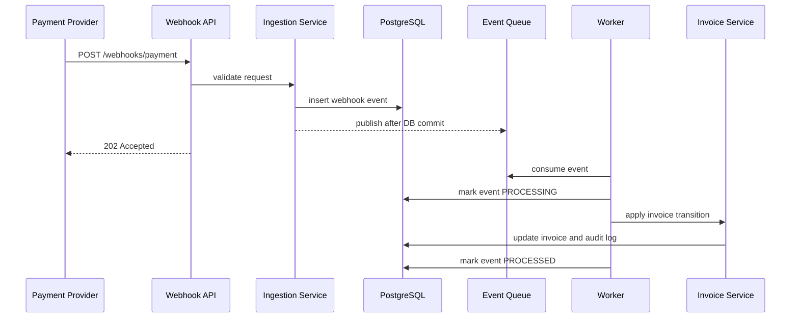
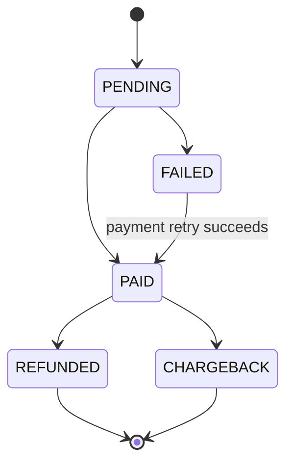
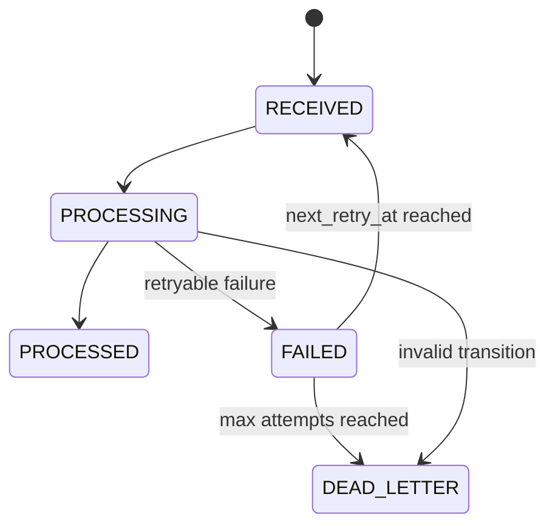
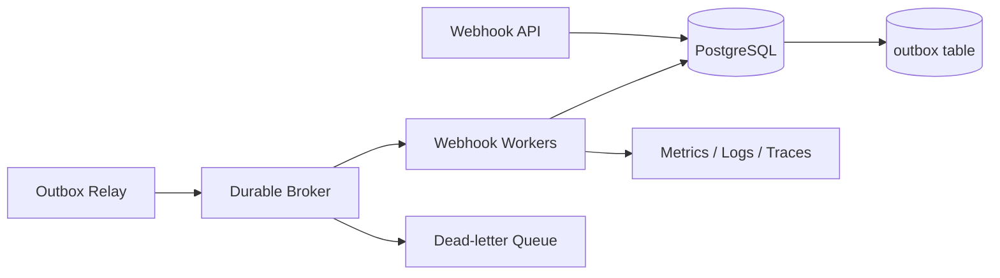

# Billing Webhook Processor

[](https://github.com/Dolanss/Event-driven_billing/actions/workflows/ci.yml)

Backend service for processing payment webhooks with idempotent ingestion, asynchronous execution, invoice state transitions, retry/backoff, audit logging, PostgreSQL migrations and Prometheus-compatible metrics.

The project models a common billing problem: external payment providers can deliver events more than once, deliver them late, or fail during delivery. The service keeps a durable record of every received event, applies business rules through a controlled invoice state machine and exposes enough operational signals to reason about failures.

## Why This Project Exists

Webhook processing is deceptively simple at small scale and easy to get wrong in production. A robust implementation needs to handle duplicate delivery, transient failures, invalid state transitions, auditability, monitoring and safe retries.

This repository focuses on those backend engineering concerns rather than on CRUD screens:

- Receive payment events from an external provider.
- Persist each event before asynchronous processing.
- Prevent duplicate processing through a database uniqueness constraint.
- Apply invoice state changes inside a transaction.
- Store audit history for every invoice transition.
- Retry transient failures and isolate non-processable events.
- Expose health and metrics endpoints for operations.

## Architecture



The local implementation uses an in-memory bounded queue to keep the project easy to run. In a production deployment, this component should be replaced with a durable broker such as RabbitMQ, Amazon SQS or Kafka, usually with a transactional outbox between PostgreSQL and the broker.

## Processing Flow



## Invoice State Machine



Invalid transitions are treated as business rule violations and moved to `DEAD_LETTER` instead of being retried.

## Retry Flow



## Tech Stack

- Java 21
- Spring Boot 3.2
- Spring Web, Data JPA, Security, Validation and Actuator
- PostgreSQL 16
- Flyway
- Micrometer and Prometheus registry
- Docker and Docker Compose
- JUnit, Mockito, Awaitility and Testcontainers
- GitHub Actions

## Features

| Area | Implementation |
|---|---|
| Webhook ingestion | `POST /webhooks/payment` returns `202 Accepted` after validation and persistence |
| Idempotency | `event_id` is protected by a unique database constraint |
| Transaction safety | Queue publication is scheduled after the event insert commits |
| Async processing | Bounded in-memory queue and virtual-thread consumer |
| Business rules | Invoice state machine blocks invalid transitions |
| Auditability | Invoice transitions are recorded in `audit_logs` in the same transaction |
| Retry | Exponential backoff with a max retry count |
| Dead-letter | Non-processable events are marked as `DEAD_LETTER` |
| Persistence | PostgreSQL schema managed by Flyway |
| Observability | Actuator health endpoint and Prometheus metrics |
| Quality | Unit and integration tests with Testcontainers |

## Technical Decisions

### Idempotency

The service relies on a unique constraint in PostgreSQL for `event_id`. This is stronger than an application-only pre-check because concurrent requests can race. Duplicate inserts are handled as conflicts and returned as `409 Conflict`.

### Transaction Boundaries

The invoice update and audit log insert happen in the same transaction. This keeps the current invoice state and its historical trail consistent.

Webhook events are published to the local queue after the database transaction commits. That avoids workers attempting to process an event that has not yet become visible in PostgreSQL.

### Optimistic Locking

Invoices include a version column for optimistic locking. This protects state transitions from lost updates when multiple events for the same invoice are processed concurrently.

### Retry Semantics

The service separates retryable technical failures from permanent business failures. Invalid invoice transitions are not retried because retrying would not change the business rule outcome.

## Trade-offs and Known Limitations

- The queue is in-memory and not durable. Restarting the application can lose queued-but-not-yet-processed messages.
- The service does not implement a transactional outbox yet.
- Queue publication after commit improves transaction visibility but still needs a recovery mechanism for events persisted and not queued due to local queue saturation.
- Basic Auth is used for local simplicity. Real payment webhooks should use signed payloads with timestamp validation and replay protection.
- The current design is a single-service deployment. Horizontal scaling requires replacing the local queue with a broker and coordinating message ownership.
- Metrics cover the core processing flow, but production deployments would need stronger SLO-oriented dashboards.

## Production Evolution

The next production-grade step would be:



Recommended improvements:

- Transactional outbox for reliable event publication.
- Durable broker with acknowledgements, redelivery and DLQ.
- HMAC webhook signature validation.
- Structured JSON logs with `eventId`, `invoiceId`, `eventType` and `attempt`.
- Distributed tracing if the worker and API are split.
- Recovery job for stale `RECEIVED` or `PROCESSING` events.
- Load tests for queue saturation, DB pool pressure and retry behavior.

## API

### Authentication

All application endpoints require HTTP Basic authentication, except selected Actuator endpoints.

Default local credentials:

| Variable | Default |
|---|---|
| `WEBHOOK_USERNAME` | `stripe-provider` |
| `WEBHOOK_PASSWORD` | `super-secret-key` |

### Receive Payment Event

```http
POST /webhooks/payment
Authorization: Basic base64(username:password)
Content-Type: application/json
```

```json
{
  "eventId": "evt_001",
  "invoiceId": "INV-2026-001",
  "eventType": "PAID",
  "amount": 149.99,
  "currency": "BRL",
  "customerId": "cust-abc",
  "metadata": null
}
```

Supported event types:

- `PAID`
- `FAILED`
- `REFUNDED`
- `CHARGEBACK`

Responses:

| Status | Meaning |
|---|---|
| `202 Accepted` | Event persisted and accepted for asynchronous processing |
| `400 Bad Request` | Invalid request body |
| `401 Unauthorized` | Missing or invalid credentials |
| `409 Conflict` | Duplicate `eventId` |

Business validation that depends on the current invoice state happens asynchronously. Invalid state transitions are recorded on the webhook event and moved to `DEAD_LETTER`.

### Other Endpoints

| Method | Path | Description |
|---|---|---|
| `GET` | `/invoices/{externalId}` | Returns current invoice state |
| `GET` | `/webhooks/payment/{invoiceId}/audit` | Returns invoice transition history |
| `GET` | `/actuator/health` | Health check |
| `GET` | `/actuator/prometheus` | Prometheus metrics |

## Running Locally

### Docker Compose

```bash
docker compose up --build
```

The API will be available at:

```text
http://localhost:8080
```

### Local Java Runtime

Requirements:

- Java 21
- Maven
- PostgreSQL 16

```bash
export DB_HOST=localhost
export DB_PORT=5432
export DB_NAME=webhookdb
export DB_USER=webhookuser
export DB_PASSWORD=webhookpass
export WEBHOOK_USERNAME=stripe-provider
export WEBHOOK_PASSWORD=super-secret-key

mvn spring-boot:run
```

## Example Requests

```bash
BASE="http://localhost:8080"
AUTH="-u stripe-provider:super-secret-key"

curl $AUTH -s -X POST "$BASE/webhooks/payment" \
  -H "Content-Type: application/json" \
  -d '{
    "eventId":"evt-1",
    "invoiceId":"INV-001",
    "eventType":"PAID",
    "amount":99.90,
    "currency":"BRL",
    "customerId":"cust-1"
  }'

curl $AUTH -s "$BASE/invoices/INV-001"

curl $AUTH -s "$BASE/webhooks/payment/INV-001/audit"
```

## Running Tests

Integration tests require Docker because Testcontainers starts a real PostgreSQL instance.

```bash
mvn test
```

The test suite covers:

- Successful webhook ingestion and asynchronous processing
- Duplicate event rejection
- Authentication failure
- Invoice state transitions
- Audit history endpoint
- Bean Validation failures
- Public health endpoint
- Unit-level state machine behavior

## Environment Variables

Use `.env.example` as a local reference.

| Variable | Default | Description |
|---|---|---|
| `DB_HOST` | `localhost` | PostgreSQL host |
| `DB_PORT` | `5432` | PostgreSQL port |
| `DB_NAME` | `webhookdb` | Database name |
| `DB_USER` | `webhookuser` | Database user |
| `DB_PASSWORD` | `webhookpass` | Database password |
| `WEBHOOK_USERNAME` | `stripe-provider` | Basic Auth username |
| `WEBHOOK_PASSWORD` | `super-secret-key` | Basic Auth password |
| `SERVER_PORT` | `8080` | HTTP server port |

## Repository Structure

```text
docs/
|-- architecture.md  # Architecture notes and production evolution
`-- operations.md    # Metrics, failure scenarios and runbook

src/main/java/com/billing/webhook/
|-- config/          # Security, Jackson, async and metrics configuration
|-- controller/      # HTTP endpoints
|-- domain/          # JPA entities and enums
|-- dto/             # Request and response models
|-- exception/       # Domain exceptions and global handler
|-- queue/           # Local queue abstraction and consumer
|-- repository/      # Spring Data repositories
`-- service/         # Ingestion, processing, invoice, retry and audit logic

src/main/resources/
|-- application.yml
`-- db/migration/    # Flyway migrations
```

## Documentation

- [Architecture](docs/architecture.md)
- [Operations](docs/operations.md)
- [Security Policy](SECURITY.md)

## Operational Signals

Useful signals to watch:

- HTTP request rate and status codes
- Queue size
- Event processing success/failure counters
- Retry count and dead-letter count
- PostgreSQL connection pool utilization
- Processing latency and oldest queued event age

## Roadmap

- Replace local queue with RabbitMQ, SQS or Kafka.
- Add transactional outbox and relay.
- Add signed webhook verification.
- Add stale event recovery.
- Add structured logging and trace correlation.
- Add load tests for burst traffic and queue saturation.
- Add operational runbook for retry and dead-letter handling.

## License

MIT
