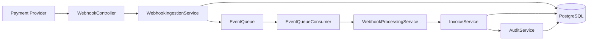
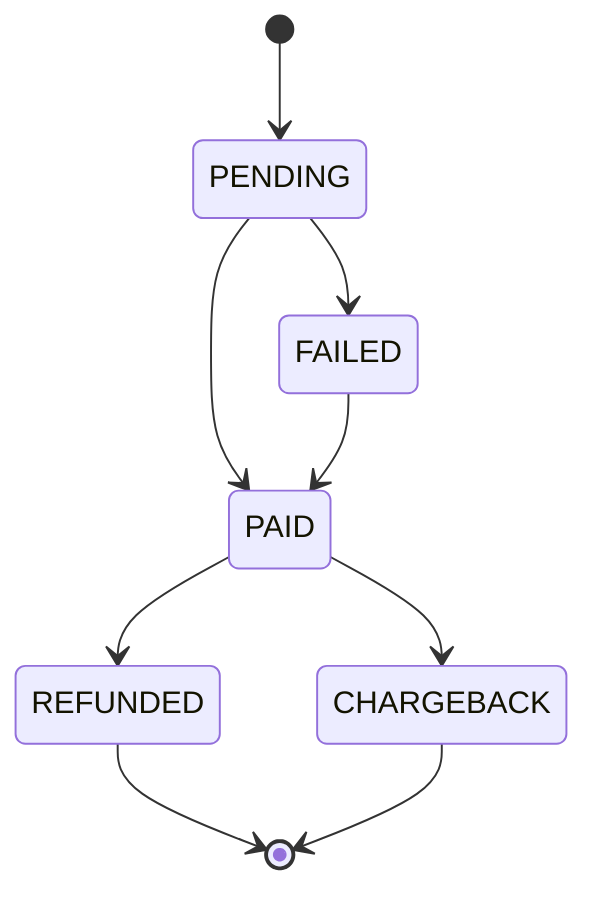
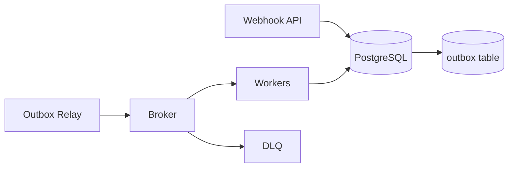

# Architecture

## Overview

Billing Webhook Processor is a single Spring Boot service that receives payment events, persists them idempotently and processes invoice state transitions asynchronously.

The service is intentionally small, but it models production concerns that appear in real billing systems:

- Duplicate webhook delivery.
- Event processing outside the request thread.
- Invoice state transitions.
- Auditability.
- Retry and dead-letter handling.
- Operational metrics.

## Components

## Transaction Model

The ingestion flow inserts a `webhook_events` row and relies on PostgreSQL to enforce uniqueness for `event_id`. This makes duplicate handling safe under concurrent requests.

The processing flow updates the invoice and writes the audit log in the same transaction. If the invoice transition fails, the audit entry is not written.

The local queue publication is registered after the ingestion transaction commits. This avoids a worker consuming an event before the database insert becomes visible.

## State Machine

## Production Evolution

For production, the in-memory queue should be replaced by a durable broker. A common evolution is the transactional outbox pattern:

This avoids losing the handoff between database commit and message publication.
