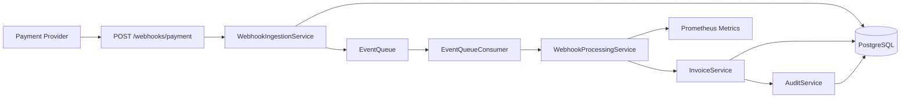
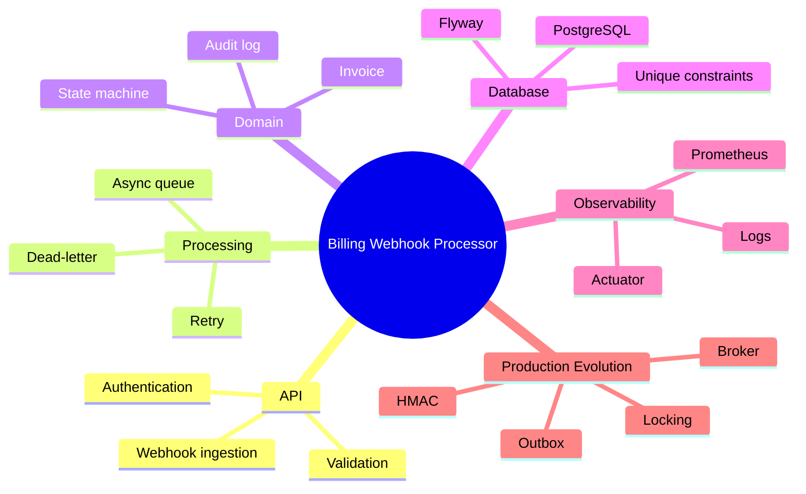
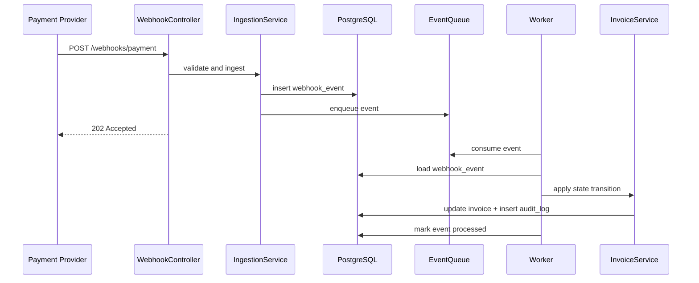
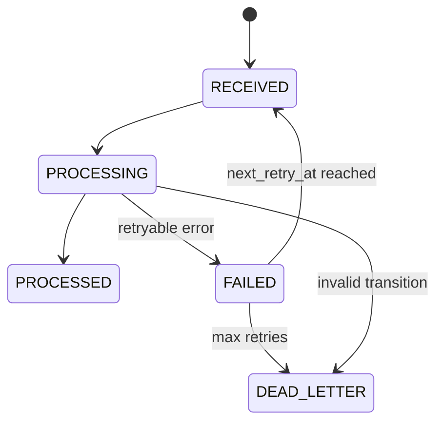

# Event-driven Billing - Portfolio Upgrade Plan

## 1. Posicionamento do Projeto

### Problema real

Sistemas de billing dependem de eventos externos de pagamento, como pagamento aprovado, falha, reembolso e chargeback. Esses eventos podem chegar duplicados, atrasados, fora de ordem ou durante indisponibilidades parciais. O projeto modela um processador de webhooks que recebe eventos, registra a entrada de forma idempotente, processa assincronamente, atualiza o estado da invoice e cria trilha de auditoria.

### Contexto de negócio

O contexto plausível é uma plataforma SaaS, marketplace ou sistema financeiro que precisa manter o estado de cobranças sincronizado com um provedor externo de pagamentos. O valor de negócio está em evitar cobrança incorreta, perda de eventos, inconsistência em reembolsos e falta de rastreabilidade.

### Interesse técnico

- Combina API HTTP, persistência, transações, fila, retry, idempotência, audit log, observabilidade e segurança básica.
- Permite discutir trade-offs reais de sistemas distribuídos: entrega at-least-once, duplicidade, ordering, DLQ, backpressure e recovery.
- Tem uma narrativa melhor que um CRUD comum, porque existe fluxo assíncrono e consistência de estado.

### Como diferenciar de projeto genérico

Não vender como "sistema de pagamento completo". Posicionar como "webhook processor de billing com foco em idempotência, consistência transacional e observabilidade". A diferenciação vem de explicar falhas reais: duplicidade, crash entre persistência e fila, eventos fora de ordem, retry e dead-letter.

### Explicação por público

- RH: "Projeto backend que processa eventos de pagamento de forma segura e rastreável, usando Java, Spring Boot, PostgreSQL, Docker e testes de integração."
- Recrutador técnico: "API de webhooks com idempotência por unique constraint, processamento assíncrono, máquina de estados de invoice, retry/backoff, audit log transacional e métricas Prometheus."
- Tech lead: "O projeto demonstra o fluxo completo de ingestion e processamento; a versão atual usa fila em memória para simplicidade, mas a evolução natural é outbox + broker durável."
- Engenheiro sênior: "O ponto central é garantir consistência sob entrega duplicada e falhas parciais. Eu defenderia unique constraints, transações curtas, auditabilidade e um plano de migração para RabbitMQ/SQS/Kafka com DLQ real."

### Descrições prontas

GitHub:

> Event-driven billing webhook processor in Java and Spring Boot, with idempotent ingestion, async processing, invoice state machine, retry/backoff, audit log, PostgreSQL migrations, Docker and Prometheus metrics.

LinkedIn:

> Built a backend webhook processor for billing events, focused on idempotency, asynchronous processing, transactional invoice state transitions, auditability and production-oriented observability.

Descrição técnica longa:

> Backend service for processing payment provider webhooks. The application accepts billing events through a secured HTTP endpoint, persists each event with an idempotency key, dispatches processing asynchronously, applies invoice state transitions inside a transaction and records an audit trail for every state change. The project includes PostgreSQL schema migrations, Docker Compose setup, integration tests with Testcontainers, retry/backoff logic, dead-letter status handling and Prometheus-compatible metrics.

Elevator pitch:

> "É um processador de webhooks de billing. Ele recebe eventos de pagamento, evita duplicidade com chave idempotente, processa de forma assíncrona, aplica uma máquina de estados na invoice e grava auditoria transacional. A versão atual é compacta para portfólio, mas foi desenhada para evoluir para outbox, broker durável e DLQ real."

## 2. Estrutura Profissional de Repositório

### Estado atual

Boa separação básica: `controller`, `service`, `repository`, `domain`, `dto`, `queue`, `config` e `exception`. Isso é defensável para um monólito modular pequeno.

### Melhorias recomendadas

- Corrigir compatibilidade Java: usar Java 21 se mantiver virtual threads, ou trocar para executor comum em Java 17.
- Adicionar `.env.example` com variáveis sem segredos reais.
- Adicionar `docs/architecture.md`, `docs/operations.md`, `docs/testing.md` e `docs/decisions/`.
- Adicionar CI com build, testes, análise estática e validação de Docker build.
- Adicionar Checkstyle/Spotless ou Maven formatter.
- Separar melhor casos de uso de infraestrutura se o projeto crescer.
- Adicionar tratamento explícito de `DataIntegrityViolationException` para duplicidade.
- Adicionar lock/versionamento em `Invoice`.

### Estrutura ideal

```text
.
├── docs/
│   ├── architecture.md
│   ├── operations.md
│   ├── testing.md
│   └── decisions/
│       ├── 0001-idempotency-strategy.md
│       ├── 0002-async-processing-model.md
│       └── 0003-retry-and-dead-letter.md
├── src/
│   ├── main/
│   │   ├── java/com/billing/webhook/
│   │   └── resources/db/migration/
│   └── test/
├── .env.example
├── .github/workflows/ci.yml
├── docker-compose.yml
├── Dockerfile
├── README.md
└── pom.xml
```

### Arquivos ausentes de alto impacto

- `.env.example`
- `.github/workflows/ci.yml`
- `docs/architecture.md`
- `docs/operations.md`
- `docs/decisions/*.md`
- `CONTRIBUTING.md`
- `SECURITY.md`

## 3. README Profissional Proposto

Conteúdo sugerido para substituir ou evoluir o `README.md` principal:

# Billing Webhook Processor

Backend service for processing billing webhooks from a payment provider. The service receives payment events, stores them idempotently, processes them asynchronously, updates invoice state through a controlled state machine and records an audit trail for operational traceability.

## Motivation

Payment providers commonly deliver events more than once, with delays, transient failures or ordering issues. This project explores the backend patterns required to process those events safely: idempotency, durable state, transactional updates, retry, dead-letter handling and observability.

## Architecture



## Stack

- Java / Spring Boot
- Spring Web, Data JPA, Security, Validation and Actuator
- PostgreSQL and Flyway
- Micrometer and Prometheus
- Docker and Docker Compose
- JUnit, Mockito, Awaitility and Testcontainers

## Features

- Idempotent webhook ingestion by event id
- Asynchronous processing pipeline
- Invoice state machine
- Retry with exponential backoff
- Dead-letter status for non-processable events
- Transactional audit log
- PostgreSQL schema migrations
- Actuator health and Prometheus metrics
- Integration tests with real PostgreSQL container

## Technical Decisions

- The event id is stored with a unique constraint to protect against duplicate webhook delivery.
- Invoice updates and audit log writes happen in the same transaction.
- Invalid state transitions are treated as business failures and are not retried.
- Retryable failures use backoff and eventually move to dead-letter status.
- The current queue is in-memory for local execution; production would use a durable broker.

## Trade-offs

- The in-memory queue is simple and easy to run locally, but it is not durable and does not support horizontal scale.
- Basic Auth is sufficient for a controlled demo, but real providers should use signed webhooks.
- The current implementation demonstrates the processing model; production should add outbox, broker acknowledgements, locking and stronger recovery.

## Security

- Stateless HTTP Basic authentication for API endpoints
- Public health endpoint for container orchestration
- Recommended production hardening: HMAC signatures, timestamp validation, replay protection, TLS-only traffic, secret rotation and payload redaction

## Observability

- Health endpoints through Spring Actuator
- Prometheus metrics for processed events and queue size
- Recommended production metrics: queue age, processing latency, retry count, dead-letter count, duplicate count and database pool saturation

## Running Locally

```bash
docker compose up --build
```

## Running Tests

```bash
mvn test
```

## Environment Variables

| Variable | Description |
|---|---|
| DB_HOST | PostgreSQL host |
| DB_PORT | PostgreSQL port |
| DB_NAME | Database name |
| DB_USER | Database user |
| DB_PASSWORD | Database password |
| WEBHOOK_USERNAME | Webhook API username |
| WEBHOOK_PASSWORD | Webhook API password |
| SERVER_PORT | HTTP port |

## Main Endpoints

- `POST /webhooks/payment`
- `GET /invoices/{externalId}`
- `GET /webhooks/payment/{invoiceId}/audit`
- `GET /actuator/health`
- `GET /actuator/prometheus`

## Known Limitations

- Queue is in-memory and not durable
- No transactional outbox yet
- No optimistic locking on invoices
- No HMAC webhook signature validation
- No real DLQ broker integration

## Technical Roadmap

- Replace in-memory queue with durable broker
- Add transactional outbox
- Add optimistic locking for invoice updates
- Add signed webhook verification
- Add structured JSON logs and tracing
- Add CI pipeline and static analysis
- Add load tests and operational runbook

## 4. Diagramas Mermaid

### Mindmap



### Sequência



### Pipeline de retry



## 5. Histórico de Commits Realista

> Não reescrever histórico real apenas para parecer orgânico. Use esta sequência como plano para PRs futuros ou branches de evolução.

| Commit | Conteúdo | Arquivos |
|---|---|---|
| chore: initialize Spring Boot billing service | Estrutura inicial, dependências, app bootstrapping | `pom.xml`, `WebhookProcessorApplication.java` |
| feat: add invoice and webhook event domain model | Entidades, enums e repositórios | `domain/`, `repository/` |
| db: add Flyway migrations for billing schema | Tabelas, constraints e índices | `db/migration/` |
| feat: implement webhook ingestion endpoint | Controller, DTOs, validação e resposta 202 | `controller/`, `dto/`, `service/` |
| fix: handle duplicate webhook events through database constraint | Tratamento de duplicidade no save, não apenas pre-check | `WebhookIngestionService`, exception handler |
| feat: add asynchronous event processing pipeline | Fila, consumer e processor | `queue/`, `WebhookProcessingService` |
| feat: enforce invoice state machine and audit log | Regras de transição e auditoria transacional | `InvoiceService`, `AuditService` |
| feat: add retry backoff and dead-letter status | Retry scheduler, campos de erro e tentativas | `RetrySchedulerService`, migrations |
| test: add integration tests with PostgreSQL container | Testcontainers, Awaitility e fluxo completo | `src/test/` |
| observability: expose health checks and Prometheus metrics | Actuator, counters e gauges | `application.yml`, `MetricsConfig` |
| security: add stateless webhook authentication | Spring Security e variáveis de ambiente | `SecurityConfig` |
| ci: add build and test workflow | Pipeline GitHub Actions | `.github/workflows/ci.yml` |
| docs: document architecture and operational trade-offs | README e docs técnicos | `README.md`, `docs/` |
| refactor: prepare processing pipeline for durable broker | Interfaces para publisher/consumer | `queue/`, `service/` |
| perf: add indexes for retry and audit queries | Índices por status, retry e invoice | migrations |

## 6. Engenharia de Produção

### O que falta para produção real

- Logs estruturados: permitem filtrar por `eventId`, `invoiceId`, `attempt` e `status`.
- Tracing: útil quando API, worker, banco e broker viram componentes separados.
- Métricas de latência: request latency, queue wait time, processing time e end-to-end latency.
- Broker durável: necessário para sobreviver a restart e escalar workers.
- Transactional outbox: evita perda entre commit no banco e publish na fila.
- Timeouts: evitam threads presas em dependências lentas.
- Rate limiting: protege contra rajadas do provider ou abuso.
- Circuit breaker: útil quando há chamadas externas, como consulta ao payment provider.
- Optimistic locking: evita update perdido em eventos concorrentes da mesma invoice.
- Recovery de `PROCESSING`: job para eventos travados após crash.
- DLQ operacional: permite inspeção, replay controlado e alertas.
- Signed webhooks: HMAC, timestamp e replay protection.
- Graceful shutdown: parar de aceitar novo trabalho e concluir mensagens em andamento.

### Buzzword engineering a evitar

- Kubernetes sem necessidade operacional clara.
- Kafka apenas para parecer sofisticado, se RabbitMQ/SQS resolver melhor.
- Microservices para um domínio pequeno.
- Cache em fluxo de escrita crítico sem problema real de leitura.

## 7. Testes e Qualidade

### Importantes

- Unit tests da state machine.
- Integration tests com PostgreSQL real.
- Teste de duplicidade concorrente.
- Teste de retry e dead-letter.
- Teste de evento fora de ordem.
- Teste de validação e autenticação.
- Teste de migration com Flyway.

### Úteis, mas não prioritários

- Load test simples com k6 ou Gatling.
- Contract test se houver provider/consumer formal.
- Mutation testing para regras críticas.

### Esperado por entrevistador

Saber explicar por que Testcontainers vale mais que mockar JPA nesse caso: o comportamento importante depende de constraints, transações, índices e PostgreSQL real.

## 8. Defensibilidade Técnica

### Pontos fortes

- Domínio melhor que CRUD.
- Idempotência aparece como preocupação central.
- Boa base de transação, audit log, migrations e testes.
- Observabilidade mínima já existe.

### Pontos fracos

- Java 17 declarado com API de virtual threads de Java 21.
- Fila em memória não é produção.
- Sem outbox.
- Sem locking por invoice.
- Segurança de webhook simplificada.
- Métricas ainda insuficientes para operação real.

### Perguntas difíceis

- Como evitar duplicidade sob duas requests simultâneas?
- O que acontece se a aplicação cai depois de salvar o evento e antes de publicar na fila?
- Como garantir ordering por invoice?
- Como recuperar evento preso em `PROCESSING`?
- Quando um erro deve ir para retry e quando deve ir para dead-letter?
- Como proteger o endpoint contra replay attack?
- Como você escalaria workers horizontalmente?
- Quais métricas indicam degradação antes de incidentes?

### O que precisa saber para defender

Idempotência, unique constraints, isolamento transacional, at-least-once delivery, outbox pattern, DLQ, retry/backoff, optimistic locking, HMAC webhook signatures, Prometheus metrics, graceful shutdown e Testcontainers.

## 9. Evolução para Senior-Looking

### Júnior forte

- README claro.
- Docker Compose funcionando.
- Testes unitários e integração básica.
- Validação de entrada.
- Migrations versionadas.

### Pleno

- Tratamento correto de duplicidade por constraint.
- CI pipeline.
- Logs estruturados.
- Métricas úteis.
- Documentação de decisões arquiteturais.

### Pleno avançado

- Outbox pattern.
- Broker durável.
- DLQ com replay controlado.
- Optimistic locking.
- Testes de concorrência e retry.
- Runbook operacional.

### Senior-level

- Discussão clara de delivery semantics.
- Estratégia para ordering e replay.
- Recovery de falhas parciais.
- Observabilidade orientada a SLO.
- Segurança real de webhooks.
- Plano de escala horizontal com limites conhecidos.

## 10. Roadmap Técnico Personalizado

### Alto ROI para entrevistas

1. Corrigir Java 17 vs virtual threads.
2. Implementar duplicidade via unique constraint + exception handling.
3. Documentar outbox como decisão futura ou implementar versão simples.
4. Adicionar locking em invoice.
5. Criar docs de arquitetura e operações.

### Fundamentos

- Transações e isolation levels.
- At-least-once vs exactly-once.
- Idempotência.
- Backpressure.
- Retry, jitter e DLQ.
- Índices e query planning.

### Ferramentas

- Spring Boot Actuator.
- Micrometer/Prometheus.
- Testcontainers.
- Flyway.
- GitHub Actions.
- k6 ou Gatling.
- RabbitMQ ou AWS SQS.

### Comunicação técnica

Treinar uma explicação em três camadas:

1. Negócio: manter billing consistente com eventos externos.
2. Arquitetura: ingestion, persistência, fila, worker, state machine e audit log.
3. Produção: outbox, broker, locking, observabilidade, segurança e recovery.

## 11. Resultado Final

### Avaliação geral

Projeto com bom potencial de portfólio backend. A ideia é tecnicamente defensável e conversa bem com problemas reais de sistemas de pagamento, desde que as limitações sejam assumidas com maturidade.

### Nível percebido atual

Pleno inicial, com sinais de pleno forte em testes, migrations, idempotência e observabilidade. Pode parecer menos maduro se a pessoa não souber explicar as simplificações.

### Pontos fortes

- Domínio realista.
- Fluxo assíncrono.
- State machine.
- Audit log.
- Flyway e PostgreSQL.
- Testcontainers.
- Métricas e healthcheck.

### Pontos fracos

- Inconsistência Java 17/virtual threads.
- Fila não durável.
- Sem outbox.
- Sem locking.
- Segurança simplificada.
- Falta CI e documentação operacional.

### Risco de parecer artificial

Médio se o README prometer produção real. Baixo se posicionar como "production-oriented prototype" ou "portfolio-grade backend service" com limitações conhecidas.

### Risco de parecer exagerado

Alto se chamar de sistema distribuído completo. Baixo se explicar como processador backend event-driven com simulação local de broker.

### Defensibilidade em entrevista

Boa, se você dominar os trade-offs. Excelente após corrigir Java, duplicidade concorrente, docs de arquitetura, CI e plano de outbox/broker.

### Impacto para currículo/GitHub

Alto para vagas backend Java/Spring. Médio para cloud/SRE até adicionar broker real, CI e documentação operacional.

### Melhorias prioritárias

1. Corrigir compatibilidade Java.
2. Melhorar idempotência concorrente.
3. Adicionar CI.
4. Adicionar `.env.example`.
5. Criar docs de arquitetura e operação.
6. Adicionar logs estruturados.
7. Implementar ou documentar outbox + broker.
8. Adicionar testes de concorrência, retry e dead-letter.

### Versão final ideal

Um serviço backend Spring Boot com PostgreSQL como fonte de verdade, outbox transacional, RabbitMQ/SQS para processamento durável, workers idempotentes, locking por invoice, DLQ com replay operacional, webhooks assinados, logs estruturados, métricas Prometheus, tracing, CI e documentação clara de decisões arquiteturais.
